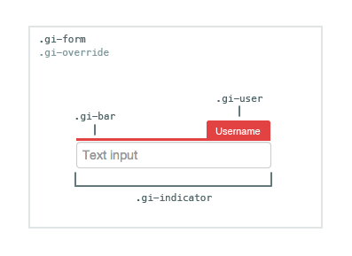

# Form

[Github Link](html/form_github.html "include")

The Form widget makes it easy to integrate real-time, multi-user capabilities into a form,
allowing two or more people to fill it out together. Multi-user forms are ideal for
collaboration, customer support scenarios, assisted sales and more.

[Form](html/form_demo_iframe.html "include")

## Feature List
- Synchronizes any HTML inputs in the form (so data is propagated between multiple users).
- Synchronizes any `form#reset` calls (form data is cleared for all users).
- Displays an indicator when users interact with form inputs (so you know who is doing what).

## HTML Element Name Attribute

To be made multi-user, any [form input elements](http://www.w3.org/TR/html5/forms.html)
must have a [name attribute](https://developer.mozilla.org/en-US/docs/Web/API/element.name).

Any inputs without name attributes will not be identifiable by the Form widget,
and thus will not be synchronized.

## Table of Contents

1. [Code Example](#code-example)
1. [HTML](#html)
1. [CSS](#css)
1. [Constructor](#constructor)
1. [Form#initialize](#form#initialize)
1. [Form#destroy](#form#destroy)
1. [Form#on](#form#on)
1. [Form#off](#form#off)
1. [Excluded Input Types](#excluded-input-types)
1. [Element Arrays](#element-arrays)

## Code Example

### 1. Include our CDN assets:

#### Note on Versioning

Specific version of widgets can be found on our [CDN](https://cdn.goinstant.net/).

```html
<script type="text/javascript" src="https://cdn.goinstant.net/v1/platform.min.js"></script>
<script type="text/javascript" src="https://cdn.goinstant.net/widgets/form/latest/form.min.js"></script>
<!-- CSS is optional -->
<link rel="stylesheet" href="https://cdn.goinstant.net/widgets/form/latest/form.css" />
```

### 2. Create an HTML form


```html
<form id="form-id">
  <label for="text-input">Try typing in here...</label>
  <input name="text-input" id="text-input" type="text" />
  <label for="textarea-input">And in here...</label>
  <textarea name="textarea-input" id="textarea-input" rows="3"></textarea>
  <label for="select-input">Choose an option...</label>
  <select name="select-input" id="select-input">
    <option value="a">A</option>
    <option value="b">B</option>
    <option value="c">C</option>
  </select>
  <label for="range-input">Slide this...</label>
  <input name="range-input" type="range" />
  <label for="radio-input">Click one...</label>
  <input name="radio-input" type="radio" value="1"/>
  <input name="radio-input" type="radio" value="2"/>
  <label for="checkbox-input">Click one...</label>
  <input name="checkbox-input" type="checkbox" value="3"/>
  <input name="checkbox-input" type="checkbox" value="4"/>
</form>
```

and some CSS to make it look nice:

```css
<style type="text/css">
  label {
    float: left;
    clear: both;
    width: 100px;
    margin: .75em 1em;
    text-align: right;
    font-family: sans-serif;
    font-size: 13px;
    color: #666;
  }
  input[type="text"],
  input[type="range"],
  select,
  textarea {
    float: left;
    margin: 1em;
    width: 140px;
  }
  input[type="radio"],
  input[type="checkbox"] {
    float: left;
    margin: 1em;
    margin-left: 32px;
    width: 40px;
  }
</style>
```

### 3. Bind the Form widget to the form element:

The Form widget works with an existing form on your page to make it
multi-user. The following code sets up a connection and then initializes a Form
widget with the form element above.

```js
// Connect URL
var url = 'https://goinstant.net/YOURACCOUNT/YOURAPP';

// Connect to GoInstant
goinstant.connect(url, function(err, platformObj, roomObj) {
  if (err) {
    throw err;
  }

  // Create a key to store the form data
  var formKey = roomObj.key('example-form-key');

  // Create a new instance of the widget
  var form = new goinstant.widgets.Form({
    el: document.getElementById('form-id'),
    key: formKey,
    room: roomObj
  });

  form.initialize(function(err) {
    if (err) {
      throw err;
    }
    // Your form should now be initialized!
  });
});
```

## HTML

### Indicator Container

The indicators are rendered to a `div` that is appended to page body once an indicator is triggered.

```html
<div class="gi-override gi-form">
  <!--  Your indicators go here -->
</div>
```

### Indicator Element

Each indicator is prepended to the container and positioned absolutely.

```html
<div class="gi-indicator">
  <div class="gi-user">
    <!-- The displayname of the user interacting with this input -->
  </div>
  <div class="gi-bar">
  </div>
</div>
```

## CSS

### Customizing the default CSS

Each class is prefixed with `gi` to avoid conflicts.  The top-level container
also has a `.gi-override` class. Our goal is to make each widget as easy as
possible to customize.

If you have not included our CSS file, you do not need to use the `gi-override`
class when styling the widget.



This stylesheet provides a good starting point for customizing the indicator,
which shows up when a user interacts with a form element:

```css
.gi-override.gi-form .gi-indicator {
  /* Base notification style customizations */
}

.gi-override.gi-form .gi-indicator .gi-user {
  /* Add custom user styles */
}

.gi-override.gi-form .gi-indicator .gi-bar {
  /* Add custom bar styles */
}
```

## Constructor

Creates the Form instance.

### Methods

- ###### **new Form(optionsObject)**

### Parameters

| optionsObject |
|:---|
| Type: [Object](https://developer.mozilla.org/en-US/docs/Web/JavaScript/Reference/Global_Objects/Object) |
| An object with the following properties: |
| - `key` is the [Key](../javascript_api/key/index.html) under which this form will be stored.|
| - `el` is the form that will be synchronized|
| - `room` is a [GoInstant Room](../javascript_api/rooms/index.html) that you have previously joined. |
| - `include` [**default: all form elements are included**] is an array of string name attributes of form elements to include.|
| - `ui` [**default: true**] is a [Boolean](https://developer.mozilla.org/en-US/docs/Web/JavaScript/Reference/Global_Objects/Boolean) that enables (true) or disables (false) the Form indicator UI. If false, the form values will still be synchronized, but there will be no indicators showing which user interacted with the element.|
| - `displayTimer` [**default: 1000**] is the [Number](https://developer.mozilla.org/en-US/docs/Web/JavaScript/Reference/Global_Objects/Number) of milliseconds that indicators are displayed before being hidden. |

### Example

#### Basic

With the default options, all inputs in the form will be synchronized.

```js
var options = {
  key: exampleRoom.key('example/key'),
  el: document.getElementById('form-id'),
  room: exampleRoom
};

var form = new Form(options);
```

#### Security

Your form may contain sensitive data.

Use `optionsObject.include`, if you only want to synchronize certain form
elements. It's a [whitelist](http://en.wikipedia.org/wiki/Whitelist) of elements
that the Form widget should observe.

Let's say you have a simple form with a password in it:

```html
<form id="my-secure-form">
  <input name="my-password" type="password" />
  <input name="my-email" type="email" />
</form>
```

You probably don't want to share the password across users. To prevent this,
you create an array of names representing the whitelist of those elements you
would like to share.

Here's an example which will only propagate the input from one form element,
'my-email' to other users, whereas any additional elements in that form such
as, say, 'my-password', won't be propagated to other users:

```js
var options = {
  key: exampleRoom.key('example/key'),
  el: document.getElementById('my-secure-form'),
  room: exampleRoom,
  include: [ 'my-email' ]
};

var form = new Form(options);
```

##### Note about Security and Interactions:

The whitelist only covers synchronization. The widget will still indicate that
a user is interacting with a field, but the data is not propagated between
users.

#### Hide Indicators

You may not want to indicate that users are interacting with the form, while
still synchronizing text inputs and other form element state.

Use `optionsObject.ui` to hide the indicator ui.

```js
var options = {
  key: exampleRoom.key('example/key'),
  el: document.getElementById('form-id'),
  room: exampleRoom,
  ui: false
};

var form = new Form(options);
```

## Form#initialize

Activates synchronization for this form with other users watching the key passed
to the constructor.

### Methods

- ###### **form.initialize(callback(errorObject))**

### Parameters

| callback(errorObject) |
|:---|
| Type: [Function](https://developer.mozilla.org/en-US/docs/Web/JavaScript/Reference/Global_Objects/Function) |
| A callback function that is returned once the form has completed being initalized. |
| - `errorObject` - will be null, unless an error has occurred. |

### Example

```js
form.initialize(function(err) {
  // now the form will be synchronized
});
```

## Form#destroy

Removes the Form propagation and indicators.

### Methods

- ###### **form.destroy(callback(errorObject))**

### Parameters

| callback(errorObject) |
|:---|
| Type: [Function](https://developer.mozilla.org/en-US/docs/Web/JavaScript/Reference/Global_Objects/Function) |
| A callback function that is returned once the form has completed being destroyed. |
| - `errorObject` - will be null, unless an error has occurred. |

### Example
```js
form.destroy(function(err) {
  // done
});
```

## Form#on

Adds an event listener to the form.

### Supported Events

* `error`: Emitted if an error is received from the GoInstant server.

### Methods

* ###### **form.on(eventName, listener)**

### Parameters

| eventName |
|:---|
| Type: [String](https://developer.mozilla.org/en-US/docs/Web/JavaScript/Reference/Global_Objects/String) |
| The name of the event to add a listener for. |

| listener |
|:---|
| Type: [Function](https://developer.mozilla.org/en-US/docs/Web/JavaScript/Reference/Global_Objects/Function) |
| The listener to add. |

## Form#off

Removes an event listener from the form.

### Methods

* ###### **form.off(eventName, listener);**

### Parameters

| eventName |
|:---|
| Type: [String](https://developer.mozilla.org/en-US/docs/Web/JavaScript/Reference/Global_Objects/String) |
| The name of the event to remove listeners for. If unsupplied, all listeners will be removed. |

| listener |
|:---|
| Type: [Function](https://developer.mozilla.org/en-US/docs/Web/JavaScript/Reference/Global_Objects/Function) |
| The listener to remove, if any. If unsupplied, all listeners will be removed for the event. |

## Excluded Input Types

The Form widget is for collaborating when filling in forms, but doesn't provide
out-of-the-box support for everything you might have in a form. Specifically,
certain input types are not shared:

- submit
- button
- file
- image

You may include these inputs in your form, but the Form widget will not share
any interactions with them.

### Element Arrays

Although we require a name for elements, you may have multiple elements with the
same name. This is common when using checkbox arrays.

The Form widget identifies elements based on their tag name, type, name, and
their order in the form.

If you were to synchronize the two forms below, they would be mismatched, as
the order is different between them.

When elements have the same name, be sure to keep their order consistent.

#### First Form

```html
<form>
  <input type="checkbox" name="a[]" value="1" />
  <input type="checkbox" name="a[]" value="2" />
  <input type="checkbox" name="a[]" value="3 "/>
</form>
```

#### Mismatched Form

```html
<form>
  <input type="checkbox" name="a[]" value="3" />
  <input type="checkbox" name="a[]" value="2" />
  <input type="checkbox" name="a[]" value="1 "/>
</form>
```
